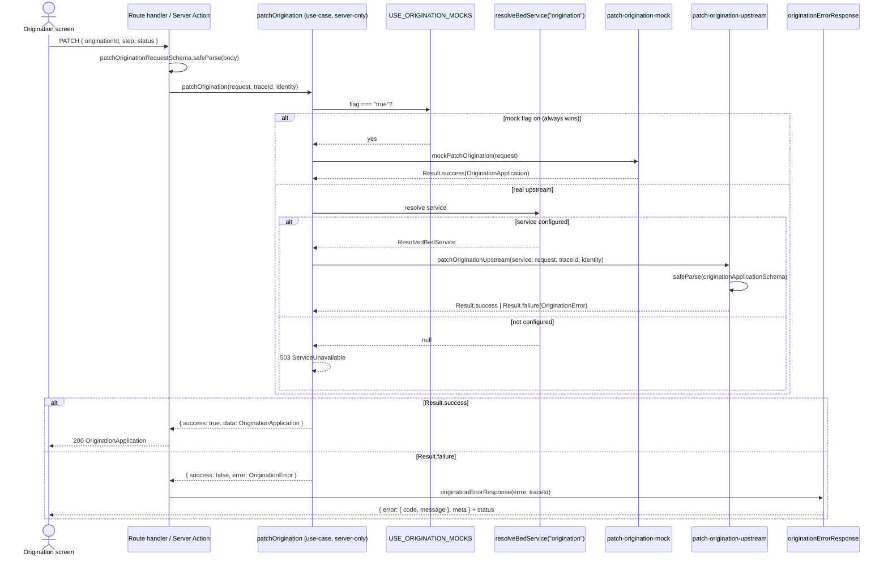
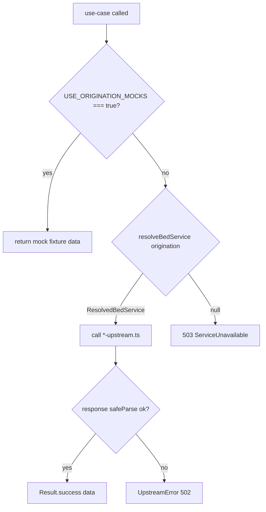
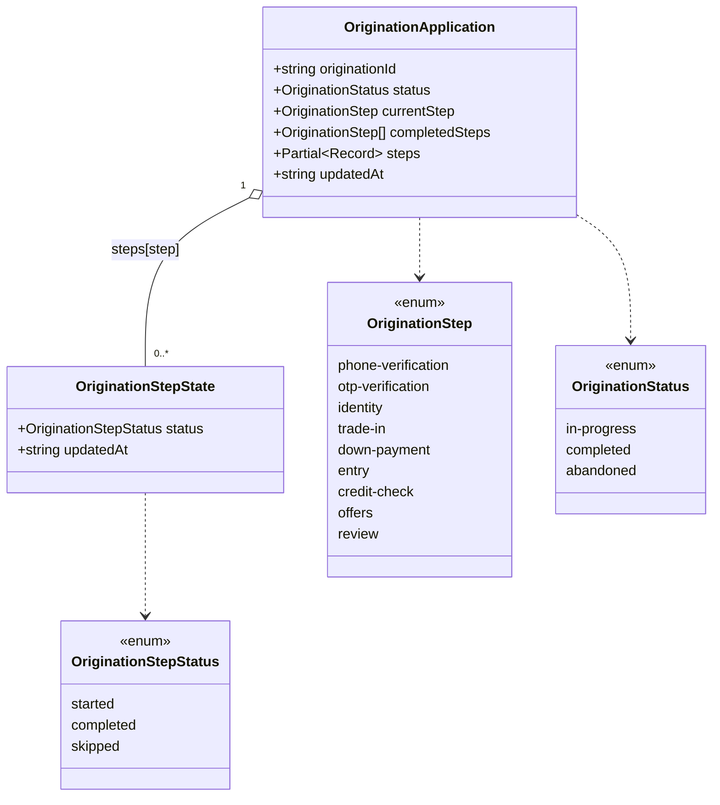
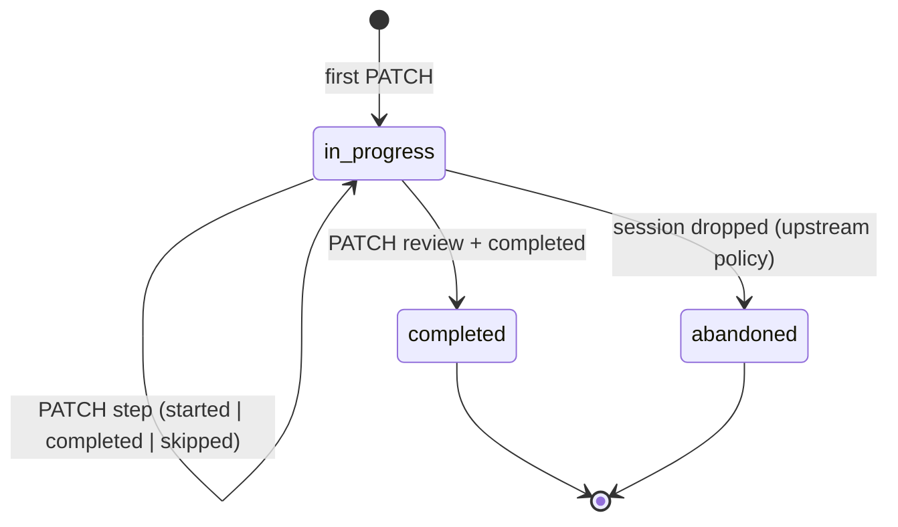
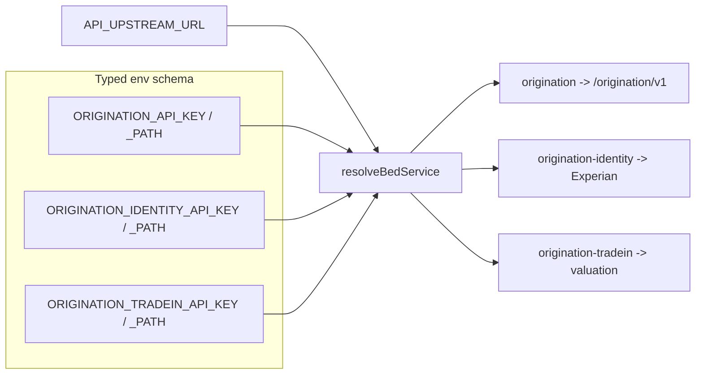

# Origination BFF — flow & data model

Foundation (FND-01) for the origination flow. Mirrors `features/search/bff` and
`features/landing/bff`: Zod contracts are the single source of truth, use-cases
return a `Result<T, E>` (never throw), and every endpoint switches between a mock
and a real BED upstream behind one env flag.

The whole domain is mocked behind a single `USE_ORIGINATION_MOCKS` flag until the
OpenAPI spec lands — at which point only the `*-upstream.ts` services and their
response `safeParse` change. Contracts, use-case signatures, and fixtures stay put.

## Layer layout

```
features/origination/bff/
  contracts/    origination-model.ts (canonical model) + <name>-request/response schemas
  errors/       origination.errors.ts (factory + code union), origination-error-response.ts
  services/     <name>-mock.ts, <name>-upstream.ts
  use-cases/    patch-origination.ts (server-only, returns Result)
  lib/          result.ts, mock-delay.ts
  __fixtures__/ typed fixtures (satisfy the Zod model)
```

## Request flow (one PATCH transition)

Each origination screen is its own route. On every state transition the client
PATCHes the **same** BFF endpoint; the use-case returns the full, unified
`OriginationApplication`.



## Mock / upstream / 503 switch

The resolution order inside every origination use-case:



## Unified data model

One canonical `OriginationApplication` is returned across the whole flow. It is
**PII-free**: raw sensitive inputs (phone, SSN, DOB, income) flow through each
step's own dedicated endpoint and are dropped server-side. Only derived,
non-sensitive state lives here.



`steps` is a **partial** record keyed by step (`z.partialRecord`), so only
reached steps appear. `currentStep`, `completedSteps`, and `status` are derived
roll-ups the UI reads directly (progress bar, flow branching).

## Application lifecycle



## BED service registration

Origination and its third-party providers are registered as **separate** BED
services in `src/config/bed-services.ts`, so credentials, versioning, and
outages stay isolated.


