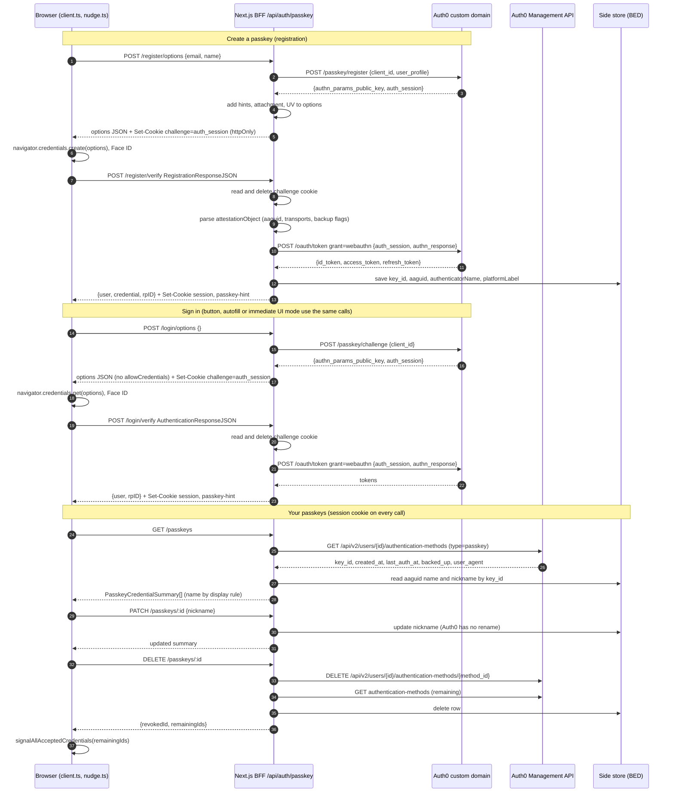

# Passkey BFF endpoints mapped to Auth0

**Context:** the BED will store passkeys in Auth0 and expose integration wrappers. This document maps each endpoint of our Next.js BFF (`/api/auth/passkey/*`, defined in `features/auth/passkey/contract.ts`) to the Auth0 API that backs it, and marks which parts are standard WebAuthn passthrough and which are extra work that our integration (BED wrapper or BFF proxy) has to add because Auth0 does not provide them.

**Sources checked on 17 September 2026:** Auth0 Native Passkeys API reference (https://auth0.com/docs/native-passkeys-api), Auth0 blog "I've got passkeys working in my app, but how do I manage them?" (https://auth0.com/blog/passkeys-management/), Auth0 Management API `GET /api/v2/users/{id}/authentication-methods` (https://auth0.com/docs/api/management/v2/users/get-authentication-methods). Confirm the current state with the BED team; Auth0 features move and some are early access.

---

## 1. Short answer

The ceremony endpoints are a standard mapping. Auth0's Native Passkeys API is the same two-call shape as ours (options, then verify) and consumes the same WebAuthn JSON that `@simplewebauthn/browser` produces, so `register/options`, `register/verify`, `login/options` and `login/verify` become thin forwards with one twist: Auth0 hands back an `auth_session` token instead of a raw challenge, and the verify step is an `/oauth/token` call that returns Auth0 tokens rather than a credential record.

The management endpoints are partly extra. Auth0 can list and delete a user's passkeys through the Management API, but it stores no AAGUID, no authenticator name and no user-chosen nickname, and it has no rename. Those three fields, which our "Your passkeys" list depends on, need a small side store owned by the BED wrapper (or the BFF), keyed by Auth0's authentication method id.

The prompting layers (capabilities, immediate UI mode, conditional UI, hint cookie, Signal API) do not involve Auth0 at all. They are browser calls plus data the proxy already has.

---

## 2. Endpoint by endpoint

Legend: **standard** = a direct mapping to an Auth0 endpoint; **proxy** = logic that lives in our route handler regardless of backend; **extra** = something Auth0 does not provide and our integration must add.

### 2.1 `POST /register/options`

| Ours | Auth0 |
| --- | --- |
| `POST /register/options` `{ email, name }` | `POST https://<custom-domain>/passkey/register` `{ client_id, realm?, user_profile: { email, name } }` |
| returns `PublicKeyCredentialCreationOptionsJSON` + challenge cookie | returns `{ authn_params_public_key, auth_session }` |

- **standard:** `authn_params_public_key` is a `PublicKeyCredentialCreationOptionsJSON`; return it to the browser as is. `startRegistration()` accepts it unchanged.
- **proxy:** put `auth_session` in the httpOnly challenge cookie (today the cookie holds the mock's challenge key). Same cookie, different content.
- **extra (policy, use case 3):** Auth0 sets `authenticatorSelection` itself: `residentKey: "required"`, `userVerification: "preferred"`. Our default policy asks for `userVerification: "required"` and `hints: ["client-device"]`, and the demo lets you set `authenticatorAttachment`. `hints` and `authenticatorAttachment` are browser-side filters, so the proxy can add them to the options before returning them without Auth0 knowing. `userVerification: "required"` can also be set in the options to make the browser insist on biometric or PIN, but Auth0 verifies with "preferred", so the server-side guarantee is weaker than the mock's; see section 4.
- **extra (`excludeCredentials`):** Auth0's signup call is for a new user, so the list is empty by definition. For adding a passkey to an existing user see 2.8.

### 2.2 `POST /register/verify`

| Ours | Auth0 |
| --- | --- |
| `POST /register/verify` `RegistrationResponseJSON` | `POST /oauth/token` `{ grant_type: "urn:okta:params:oauth:grant-type:webauthn", client_id, realm?, scope, audience, auth_session, authn_response }` |
| returns `{ user, credential, rpID }` + session and hint cookies | returns `{ access_token, id_token, refresh_token, expires_in }` |

- **standard:** `authn_response` is exactly the `RegistrationResponseJSON` the browser sent us (`id`, `rawId`, `type`, `authenticatorAttachment`, `response.clientDataJSON`, `response.attestationObject`). Forward as is. Auth0 does the verification (challenge, origin, RP ID, signature).
- **proxy:** read `auth_session` from the cookie and delete the cookie; set the app session from the returned tokens (whatever the OTP flow does with Auth0 tokens today); set the `passkey-hint` cookie when `authenticatorAttachment === "platform"`.
- **extra (`user`):** decode the `id_token` (or call `/userinfo`) to build `{ id, name, email }`.
- **extra (`credential`):** Auth0 returns tokens, not a credential summary. Two ways to build it. (a) Parse the `attestationObject` in the proxy before forwarding: `@simplewebauthn/server`'s helpers decode the authenticator data and give AAGUID, credential ID, transports, backup flags without verifying anything. (b) After the token call, fetch the user's authentication methods from the Management API and take the newest `type: "passkey"` entry. (a) is the only way to get the AAGUID, because Auth0 does not store it. Recommended: (a) for AAGUID and `authenticatorName`, plus the user agent for `platformLabel`, written to the side store keyed by Auth0's `key_id` (the credential ID) as soon as the token call succeeds.
- **extra (`rpID`):** a constant from configuration; Auth0's configured RP ID.

### 2.3 `POST /login/options`

| Ours | Auth0 |
| --- | --- |
| `POST /login/options` `{}` | `POST /passkey/challenge` `{ client_id, realm? }` |
| returns `PublicKeyCredentialRequestOptionsJSON` + challenge cookie | returns `{ authn_params_public_key, auth_session }` |

- **standard:** forward the options. Auth0 returns discoverable-credential options (no `allowCredentials`), which is what the button, conditional UI and immediate UI mode all need.
- **proxy:** `auth_session` into the challenge cookie.
- Note the cookie lifetime: conditional UI can sit armed for minutes. Ask the BED how long an `auth_session` stays valid and set the cookie `maxAge` to match.

### 2.4 `POST /login/verify`

| Ours | Auth0 |
| --- | --- |
| `POST /login/verify` `AuthenticationResponseJSON` | `POST /oauth/token`, same grant, `authn_response` with `authenticatorData`, `signature`, `userHandle` |
| returns `{ user, credential, rpID }` + session and hint cookies | returns tokens |

- **standard:** forward the assertion as is.
- **proxy:** cookie handling, app session, hint cookie, as in 2.2.
- **extra (`credential`):** look up the side store by `response.id` (the credential ID) and merge with the Management API entry for `last_auth_at`. If the summary on sign-in is not needed by the UI, return only `user` and `rpID` and drop `credential` from `PasskeyLoginResult`; the contract change is one optional field.

### 2.5 `GET /passkeys`

| Ours | Auth0 |
| --- | --- |
| `GET /passkeys` (session cookie) | Management API `GET /api/v2/users/{user_id}/authentication-methods`, filter `type === "passkey"`; server-to-server with a Management API token, never from the browser |

Auth0 returns per passkey: `id` (the authentication method id, `passkey|…`), `key_id` (the WebAuthn credential ID), `public_key`, `credential_device_type`, `credential_backed_up`, `user_agent`, `identity_user_id`, `created_at`, `last_auth_at`, `confirmed`.

Mapping to `PasskeyCredentialSummary`:

| Our field | Source | Status |
| --- | --- | --- |
| `id` | Auth0 `key_id` (or `id`; pick one and use it consistently in rename and revoke) | standard |
| `publicKey`, `transports` | Auth0 `public_key`; transports are not returned, use `[]` or the side store | standard / extra |
| `createdAt`, `lastUsedAt` | Auth0 `created_at`, `last_auth_at` | standard |
| `type` (synced or device-bound), `backedUp` | Auth0 `credential_device_type`, `credential_backed_up` | standard |
| `platformLabel` ("Safari on iPhone") | Auth0 `user_agent`, parsed with our existing `platformLabelFor()` logic at read time | standard data, our parsing |
| `aaguid`, `authenticatorName` ("iCloud Keychain") | **not in Auth0**; side store written at register/verify (2.2) | **extra** |
| `nickname` | **not in Auth0**; side store | **extra** |
| `name` (display rule) | computed by the proxy or wrapper from the above | proxy |
| `counter` | not needed with Auth0; drop or return 0 | n/a |

Auth0's own dashboard shows passkeys as `passkey|<id>`, and its blog acknowledges there is no readable name; the side store is how we get one.

### 2.6 `PATCH /passkeys/:id` (rename)

**Extra.** Auth0 has no updatable name on a passkey method (the blog: "you can't update a passkey itself"). The nickname is written to the side store only. Keep the ownership check: the id must belong to the signed-in user's Auth0 list.

### 2.7 `DELETE /passkeys/:id` (revoke)

| Ours | Auth0 |
| --- | --- |
| `DELETE /passkeys/:id` returns `{ revokedId, remainingIds }` | Management API `DELETE /api/v2/users/{user_id}/authentication-methods/{authentication_method_id}` |

- **standard:** the delete.
- **proxy:** after deleting, list again and return `remainingIds` (the `key_id` values) so the browser can call the Signal API. Also delete the side-store row.
- Auth0's guidance matches ours: make sure the user keeps a fallback factor before deleting. In our case OTP always remains.

### 2.8 Adding a passkey to an existing signed-in user (the "after OTP" step, not built yet)

Auth0 separates signup with a passkey (2.1, 2.2, new user) from enrolling a passkey on an existing account, which uses the My Account API: `POST /me/v1/authentication-methods` to get creation options, then `POST /me/v1/authentication-methods/passkey|new/verify` with the attestation. This needs the user's own access token with the My Account scope, which the proxy holds after an OTP sign-in. The browser side is the same `registerPasskey()` call; only the proxy's upstream changes. This is where `excludeCredentials` matters and Auth0 should populate it from the user's existing methods.

### 2.9 `GET /session`, `POST /reset`

Mock only. Removed. Session comes from the app's existing Auth0 session.

---

## 3. What does not touch Auth0

| Piece | Where it lives | Auth0 involvement |
| --- | --- | --- |
| `getClientCapabilities()`, immediate UI mode, conditional UI | browser, `nudge.ts` | none; they consume the options from 2.3 |
| `passkey-hint` cookie | proxy, from `authenticatorAttachment` in the verified response | none |
| Signal API after revoke | browser, from `remainingIds` | none |
| One-pending-request rule, gesture gating | browser | none |
| Request and response logging | proxy | none |

---

## 4. Integration decisions to settle with the BED team

1. **RP ID versus site origin.** Auth0 requires a custom domain and binds the RP ID to it (default: the custom domain itself, optionally a parent domain). WebAuthn only allows a page to use an RP ID that equals its own registrable domain or a parent of it. If the site is `www.dealer.com` and the Auth0 custom domain is `auth.dealer.com`, the RP ID must be set to `dealer.com` (a parent of both) or passkey ceremonies on the site will fail with a `SecurityError`. Auth0's docs advise against the apex domain to keep the trust boundary small, so this is a decision, not a default. It also fixes the RP ID for the life of every passkey; changing it later orphans them all.
2. **Allowed Web Origins.** The site origin must be listed on the Auth0 application, and the `Passkey` grant type (`urn:okta:params:oauth:grant-type:webauthn`) enabled. Confirm whether the Native Passkeys API is generally available for web applications on our tenant or still early access.
3. **User verification.** Auth0 verifies with `userVerification: "preferred"`. Our mock enforces `required` server-side, which is the banking-grade setting in the registration options document. With Auth0, the proxy can still request `required` in the options so the browser insists on it, but Auth0 will accept a response without the UV flag. Decide whether that is acceptable or whether the wrapper should reject responses whose authenticator data lacks the UV flag (the proxy can read the flag from `authenticatorData` before forwarding).
4. **Side store ownership.** AAGUID, `authenticatorName`, `nickname` (and transports) have to live somewhere Auth0 is not. Options: a table in the BED wrapper keyed by Auth0 `key_id`, or Auth0 `user_metadata` on the user holding a small map of `key_id` to `{ aaguid, nickname }`. The wrapper table is cleaner; `user_metadata` avoids a new datastore. Either way the write happens in `register/verify` from the parsed attestation.
5. **Which id is `:id`.** Auth0 has two: the authentication method id (`passkey|…`, needed for `DELETE`) and `key_id` (the WebAuthn credential ID, needed for the Signal API and for matching `response.id` at sign-in). Store both; expose `key_id` as our `id` and let the wrapper translate for delete.
6. **`auth_session` lifetime.** It replaces our challenge. Cookie `maxAge` must not exceed it, and the conditional UI re-arm rule depends on it.
7. **Tokens as session.** `/oauth/token` returns Auth0 tokens. The proxy must turn them into the same app session the OTP flow produces so `useAuth`, `GuardedLink` and the assurance model (`acr: 2`, `evidence: ["passkey"]`) see a passkey sign-in the same way.

---

## 5. Sequence diagram

---

## 6. Summary table

| Our endpoint | Auth0 call | Standard | Extra |
| --- | --- | --- | --- |
| `POST /register/options` | `POST /passkey/register` | options passthrough | add `hints` / attachment / UV in proxy; store `auth_session` |
| `POST /register/verify` | `POST /oauth/token` (webauthn grant) | response passthrough, Auth0 verifies | parse attestation for AAGUID; side store; build `user` from `id_token`; session + hint cookies |
| `POST /login/options` | `POST /passkey/challenge` | options passthrough | store `auth_session` |
| `POST /login/verify` | `POST /oauth/token` (webauthn grant) | assertion passthrough | session + hint cookies; optional credential summary |
| `GET /passkeys` | Management API list methods | dates, backup flags, user agent | AAGUID name, nickname from side store; display rule |
| `PATCH /passkeys/:id` | none | none | side store only |
| `DELETE /passkeys/:id` | Management API delete method | delete | `remainingIds` for Signal API; side store cleanup |
| add passkey after OTP | My Account API enrol + verify | options and attestation passthrough | user access token with My Account scope |
| `/session`, `/reset` | none | removed | none |

The browser client, the contract types and the docs pages stay as they are. The work is the BFF route bodies (or the BED wrapper, whichever side the team puts the logic on), the side store, and the four tenant decisions in section 4.
